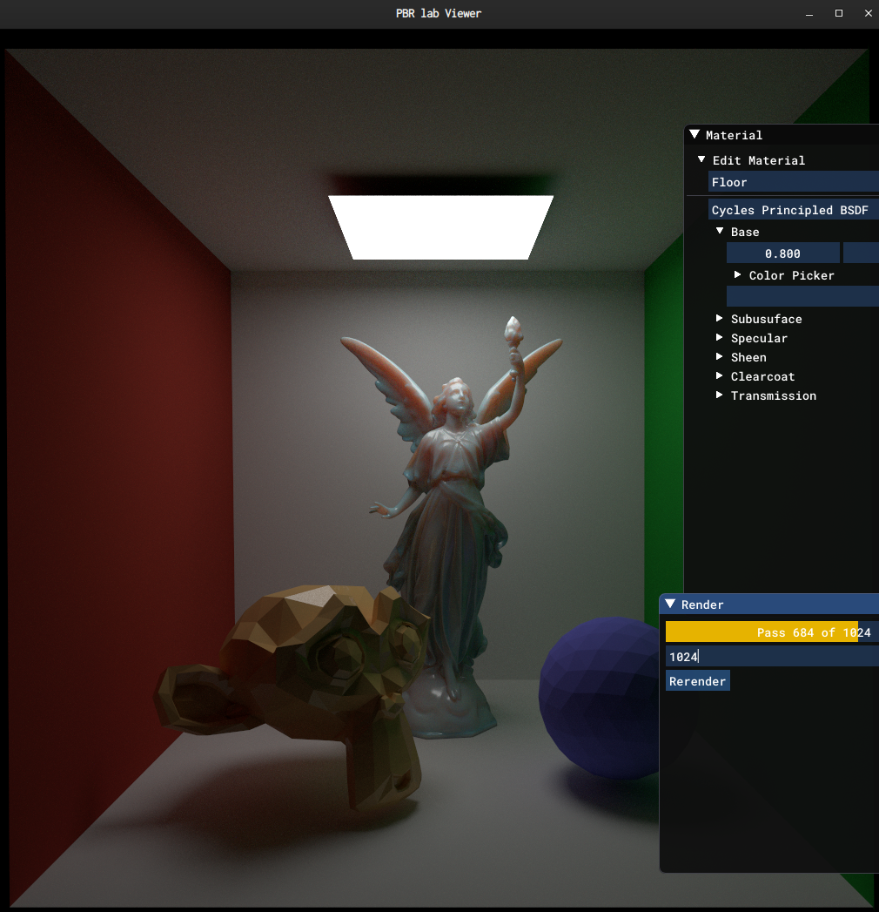

# PBR lab



https://user-images.githubusercontent.com/18676/217257086-b7e7a708-7627-4b52-be06-7e4e81b66743.mp4

`pbrlab` is well-verified(through brute force human verification and debugging) path tracing + PBR shading/rendering implementation.

`pbrlab` is good for verifying your renderer and PBR shading.

## Features

* PrincipledBSDF
  * with random-walk(brute force) pathtraced subsurface scattering. 
    * https://disney-animation.s3.amazonaws.com/uploads/production/publication_asset/153/asset/siggraph2016SSS.pdf https://disney-animation.s3.amazonaws.com/uploads/production/publication_asset/153/asset/siggraph2016SSS.pdf
    * Extending the Disney BRDF to a BSDF with Integrated Subsurface Scattering https://blog.selfshadow.com/publications/s2015-shading-course/
* (Principled) Hair BSDF
  * Our Hair BSDF is based on Cycles(pbrt-v3) and applies the fix of pbrt-v3 bug https://github.com/mmp/pbrt-v3/pull/256/files
  * Implements an improved robe evaluation method https://jo.dreggn.org/path-tracing-in-production/2018/index.html
* Cycles and Arnold compatible shading parameters.

## Requirements

* OpenGL 3.x
* cmake
* C++11 or later compiler

## Supported platform

* [x] Linux
  * [x] x64_64
  * [ ] aarch64
* [ ] Windows 10 64bit
* [ ] macOS

## Install Dependencies

### Ubuntu

```
$ sudo apt install clang cmake
$ sudo apt install libgl1-mesa-dev libglu1-mesa-dev
$ sudo apt install libxrandr-dev libxinerama-dev libxcursor-dev libxi-dev

```
#### Optional

```
$ sudo apt install ccache
```

## Setup

Checkout submodules

```
$ git submodule update --init --recursive
```

## Building

```
$ ./scripts/bootstrap-linux.sh
$ cd build
$ make
```

## How to run

Run demo scene.

```
$ pbrlab data/cornellbox_suzanne_lucy.obj
```

Surface mesh only.

```
$ pbrtlab input.obj
```

Hair only(cyhair format. Download here http://www.cemyuksel.com/research/hairmodels/).

```
$ pbrtlab input.hair
```

Mesh and Hair.

```
$ pbrtlab input.obj input.hair
```

(No xform/scene graph support at the moment)

## Model a scene.

Currently pbrlab supports wavefront .obj + .mtl with PBR + SSS extension

http://exocortex.com/blog/extending_wavefront_mtl_to_support_pbr

SSS extension is pbrlab specific.

### SSS parameter in Wavefront .mtl

Please see [src/material-param.h](src/material-param.h) and AutodeskStandardSurface

https://autodesk.github.io/standard-surface/#closures/subsurfacescattering

for details.

```
| param name        | value | description             |
+-------------------+-------+-------------------------+
| subsurface        | float | Subsurface weight       |
| subsurface_radius | RGB   | Subsurface radius(dmfp) |
| subsurface_color  | RGB   | Subsurface color        |
```

`subsurface_scale` is not supported(Please premultiply it to `subsurface_radius`)
`subsurface_anisotropy` is not supported yet.


## TODO

* [ ] More detailed description of Shader/Material parameter.
* [ ] Log
  * [ ] nanolog
* [ ] Interactive GUI
  * [x] Draw rendering
  * [x] ImGui UI
* [ ] Curve Mesh
  * [x] CyHair loader
  * [ ] xpd loader
* [ ] Cycles's Principled Bsdf
  * [x] Lambert
  * [ ] Principled diffuse
  * [x] Subsurface
    * [ ] Diffusion model
    * [x] Random walk SSS
      * [ ] Henyey Greenstein
      * [ ] single instance intersect
  * [ ] Microfacet
    * [x] reflection
    * [ ] clearcoat
    * [ ] refraction
  * [ ] sheen
* [ ] Arnold Standard Shader
* [x] Principled Hair Bsdf
* [ ] Support render config file
* [ ] Scene file
  * [ ] json(W.I.P)
  * [x] obj
  * [ ] gltf
  * [ ] USD
* [ ] Texture
  * [x] jpg, png
  * [x] OpenEXR
* [ ] Light
  * [x] Area light
  * [ ] Point light
  * [ ] Directional light
  * [ ] IBL
* Camera
  * [x] Pinhole camera
  * [ ] Thin lens camera
  * [ ] realistic camera
* GPU acceleration
  * [ ] OptiX
  * [ ] HIP RT
  * [ ] Vulkan RT

## FIXME(Need further investigation)

* Random walk SSS
  * [ ] Slightly darker result compared to Cycles' results
* Clearcoat -> Clearcoat component is too small

## License

pbrlab is licensed under MIT license.

The following files are derived from these;

* src/closure/microface-ggx.h: Open Shading Language (3-clause BSD license)
* Principled BSDF, Principled Hair BSDF. Based on Cycles' code. Apache 2.0 license.

### Third party license

* TinyObjLoader : MIT license.
* TinyEXR : BSD license.
* imgui : MIT license.
* ImGuizmo : MIT license.
* stb_image, stb_image_write, stb_image_resize : Public domain
* glfw3 : zlib/libpng license.
* glad : unlicense?
* ionicons : MIT license.
* Roboto font : Apache 2.0 license.
* toml11 : MIT license.
* rapidjson : MIT license.
* StaticJSON : MIT license.
* ghc filesystem : BSD-3 license.
* mpark variant : BSD-1 license.
* Embree-aarch64 : Apache-2.0
* pcg-random : Apache-2.0
* pbrt : BSD-2 license.
* Cycles : Apache 2.0 license
* OpenShadingLanguage : BSD-3 license. 
* OpenImageIO : BSD-3 license
* miniz: MIT license. https://github.com/richgel999/miniz
